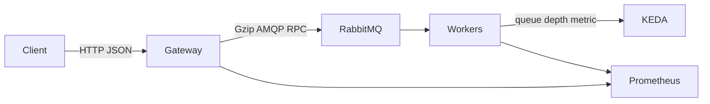

# High-Throughput RPC Platform

Java **21** / Spring Boot **3.4** reference architecture for **high-concurrency request/reply over RabbitMQ**.

This is a public portfolio piece. It is an original design inspired by production work on SaaS backends that had to hold tens of thousands of concurrent RPCs without melting the HTTP layer. It is **not** employer source code.

## The problem

A REST API that does heavy enrichment **inline** will spend most of its time in business logic on the request thread. Under load you typically see:

- HTTP p95 jumping from hundreds of milliseconds to **tens of seconds**
- Thread pools exhausted while the broker (or CPU) still has capacity
- One over-prefetching consumer starving the rest of the fleet

Pulse splits the work: the **gateway** only correlates an RPC; **workers** scale independently.



## What this repo demonstrates

| Pattern | Where |
| --- | --- |
| AMQP request/reply + correlation id | `rpc-gateway` `EnrichmentRpcClient` |
| Gzip JSON converter with size threshold | `rpc-contracts` `GzipJacksonMessageConverter` |
| Dynamic consumers + prefetch | `rpc-worker` `WorkerRabbitConfig` |
| 429 backpressure (in-flight semaphore) | `pulse.rpc.max-in-flight` |
| Retry TTL parking lot + DLQ topology | Rabbit queue declarations |
| Queue-depth Micrometer gauge | `QueueDepthMetrics` |
| Virtual threads on the wait path | `spring.threads.virtual.enabled` |
| KEDA ScaledObject on queue length | `k8s/deploy.yaml` |

## Module map

```
rpc-contracts   shared DTOs + Gzip converter (unit tested)
rpc-gateway     REST + RabbitTemplate RPC + Resilience4j timeout
rpc-worker      listeners, simulated enrichment, queue gauges
```

## Quick start

```bash
mvn -q test
mvn -q -DskipTests package
docker compose up --build
curl -s -X POST http://localhost:8080/api/v1/enrichment \
  -H 'Content-Type: application/json' \
  -d '{"tenantId":"acme","memberId":"42"}'
```

RabbitMQ UI: http://localhost:15672 (`guest`/`guest`)  
Prometheus: http://localhost:9090  
Grafana: http://localhost:3000

Without Docker, run a local RabbitMQ then:

```bash
mvn -pl rpc-gateway,rpc-worker -am spring-boot:run
```

## Design decisions

See [docs/adr](docs/adr). Short version:

1. **Gzip JSON, not Protobuf** — debug-friendly on the broker UI, big win on chatty payloads.
2. **RPC, not fire-and-forget** — the HTTP contract is synchronous; virtual threads make that viable.
3. **Scale on queue depth** — CPU HPA is late when work is wait-bound.
4. **Cap in-flight RPCs** — 429 is better than an unbounded heap of waiting virtual threads.

## Load testing

Follow [docs/LOAD-TESTING.md](docs/LOAD-TESTING.md). Do not treat any blog number as a benchmark of *this* laptop.

The same four levers (compress, prefetch, consumer autoscaling, non-blocking HTTP wait) are what take a naive 20–30s RPC API back into a few seconds under a serious soak.

## Operations

- Actuator: `/actuator/health`, `/actuator/prometheus`
- Worker env: `WORKER_CONCURRENT`, `WORKER_MAX_CONCURRENT`, `WORKER_PREFETCH`, `WORKER_WORK_MS`
- Gateway env: `PULSE_RPC_MAX_IN_FLIGHT`, `RABBITMQ_HOST`

## License

Apache-2.0
