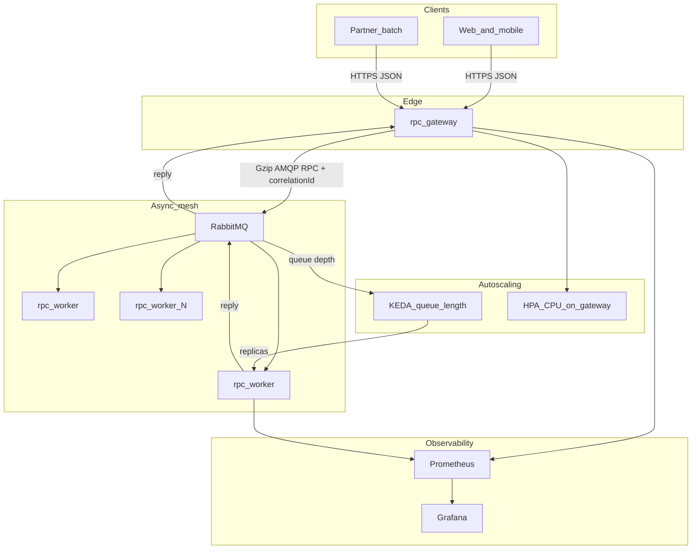
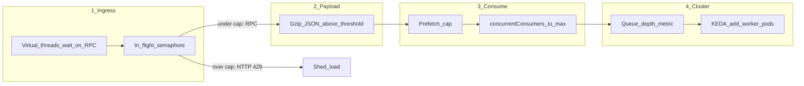
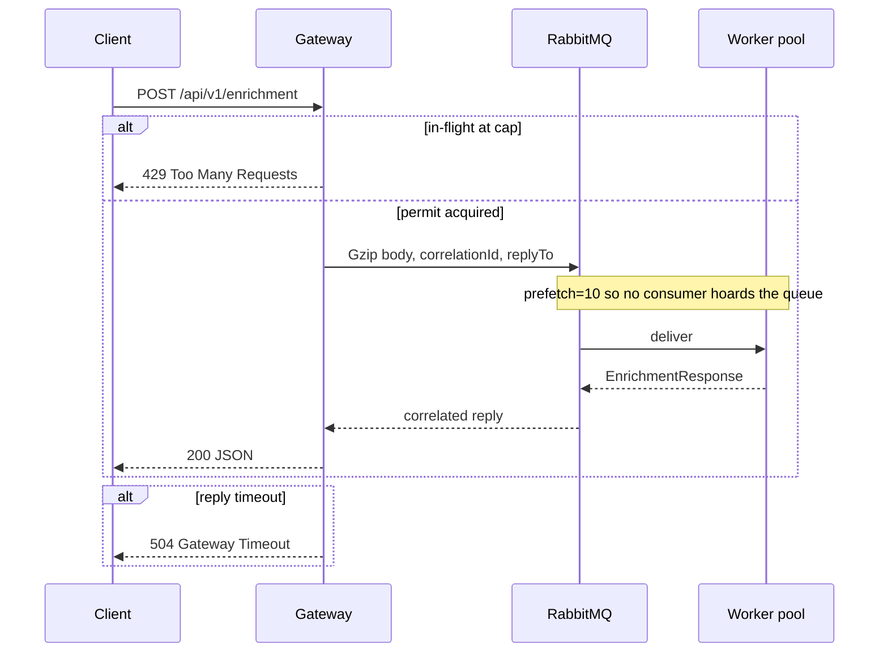
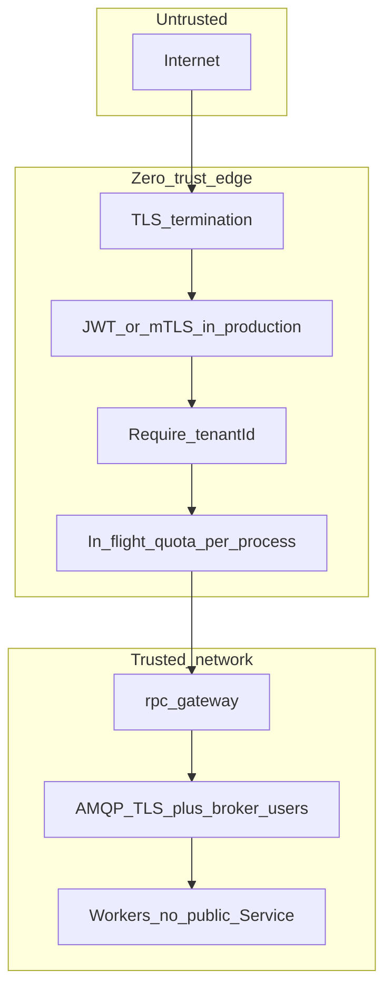
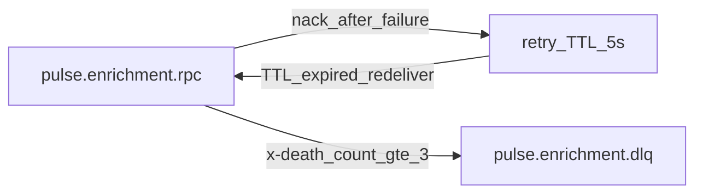
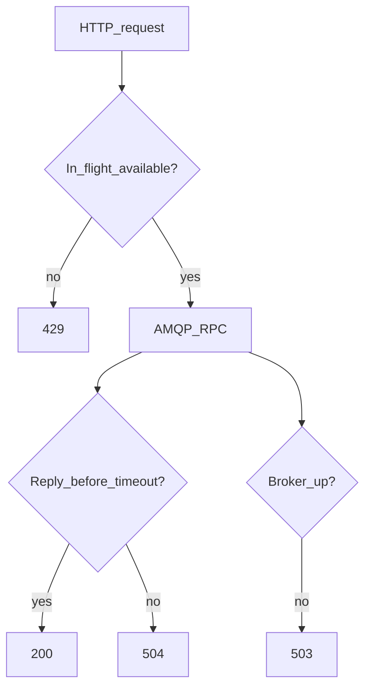

# High-Throughput RPC Platform

Java **21** / Spring Boot **3.4** reference architecture for **high-concurrency request/reply over RabbitMQ**.

Portfolio design for SaaS backends that must hold tens of thousands of concurrent RPCs without exhausting the HTTP layer. Original work — **not** employer source.

| | |
| --- | --- |
| Stack | Java 21, Spring Boot 3.4, Spring AMQP, Resilience4j, Micrometer |
| Hard problem | Synchronous HTTP that used to block 20–30s under load |
| Approach | Correlate RPC on the edge; scale workers on **queue depth**; Gzip large payloads; shed load with **429** |

---

## System context

Clients never talk to workers. The gateway is a thin, virtual-thread RPC client. Workers are the only place business CPU is spent.



---

## Scalability — how load is absorbed

Four independent levers. Tuning only CPU HPA is how APIs stay slow while the cluster still looks “idle”.





**Why this dropped multi-tens-of-seconds APIs into a few seconds**

1. **Gzip** — large tenant/feed blobs stop saturating NIC and AMQP frames.
2. **Prefetch 10** — work is shared; one slow consumer cannot pin the queue.
3. **Scale on queue depth (KEDA)** — CPU HPA is late when the wait is in the broker.
4. **Virtual threads + max-in-flight** — 50k waiting RPCs is not 50k Tomcat platform threads.

Knobs: `WORKER_CONCURRENT`, `WORKER_MAX_CONCURRENT`, `WORKER_PREFETCH`, `PULSE_RPC_MAX_IN_FLIGHT`. Methodology: [docs/LOAD-TESTING.md](docs/LOAD-TESTING.md).

---

## Security — tenant isolation, credentials, abuse

This demo uses explicit architecture seams. Production replaces the stubs with IdP/JWKS and TLS everywhere.



| Control | In this repo | Production hardening |
| --- | --- | --- |
| Edge auth | Open demo HTTP | JWT (RS256/JWKS) or mTLS at ingress |
| Tenant isolation | `tenantId` on the RPC body + `x-tenant-id` AMQP header | Enforce membership from the token, never from a client-supplied id alone |
| Abuse / noisy neighbor | Process-wide in-flight semaphore → **429** | Per-tenant rate limit (Redis) + broker user vhosts |
| Message integrity | Correlation id on every hop | Signed payloads or broker-side TLS + app checksum |
| Secrets | Env (`RABBITMQ_USER` / password) | K8s Secrets / IRSA, rotate broker creds, no guest/guest |
| Blast radius | Workers have no ingress | NetworkPolicy: only gateway → 5671, workers → broker |
| PII in queues | Enrichment blob is synthetic | Gzip is not encryption; encrypt at rest on the broker disk |

Poison messages do not retry forever:



---

## Resilience and backpressure



- Resilience4j time limiter on the client RPC (5s).
- Publisher confirms + mandatory publish on the gateway.
- Worker `defaultRequeueRejected=false` so poison goes to the retry/DLQ topology, not a hot loop.

---

## Observability

| Signal | Metric / UI | Decision it drives |
| --- | --- | --- |
| RPC wait | `pulse.rpc.client.latency` | SLO / 504 budget |
| Queueing | `pulse.rpc.queue.depth` | KEDA scale-out |
| Compression | `pulse.rpc.gzip.bytes.saved` | Keep or raise gzip threshold |
| Work | `pulse.rpc.worker.processed` | Capacity vs simulated-work-ms |

Actuator: `/actuator/health`, `/actuator/prometheus`.

---

## Module map

```
rpc-contracts   DTOs + Gzip converter (unit tested)
rpc-gateway     REST + RabbitTemplate RPC + 429/504
rpc-worker      listeners, prefetch, queue gauges
```

## Quick start

```bash
mvn -q test
mvn -q -DskipTests package
docker compose up --build
curl -s -X POST http://localhost:8080/api/v1/enrichment \
  -H 'Content-Type: application/json' \
  -d '{"tenantId":"acme","memberId":"42"}'
```

RabbitMQ UI: http://localhost:15672 (`guest`/`guest`)  
Prometheus: http://localhost:9090 · Grafana: http://localhost:3000

## Design decisions

[docs/adr](docs/adr) — Gzip vs Protobuf, RPC vs fire-and-forget, queue-depth scaling, virtual threads.

## License

Apache-2.0
